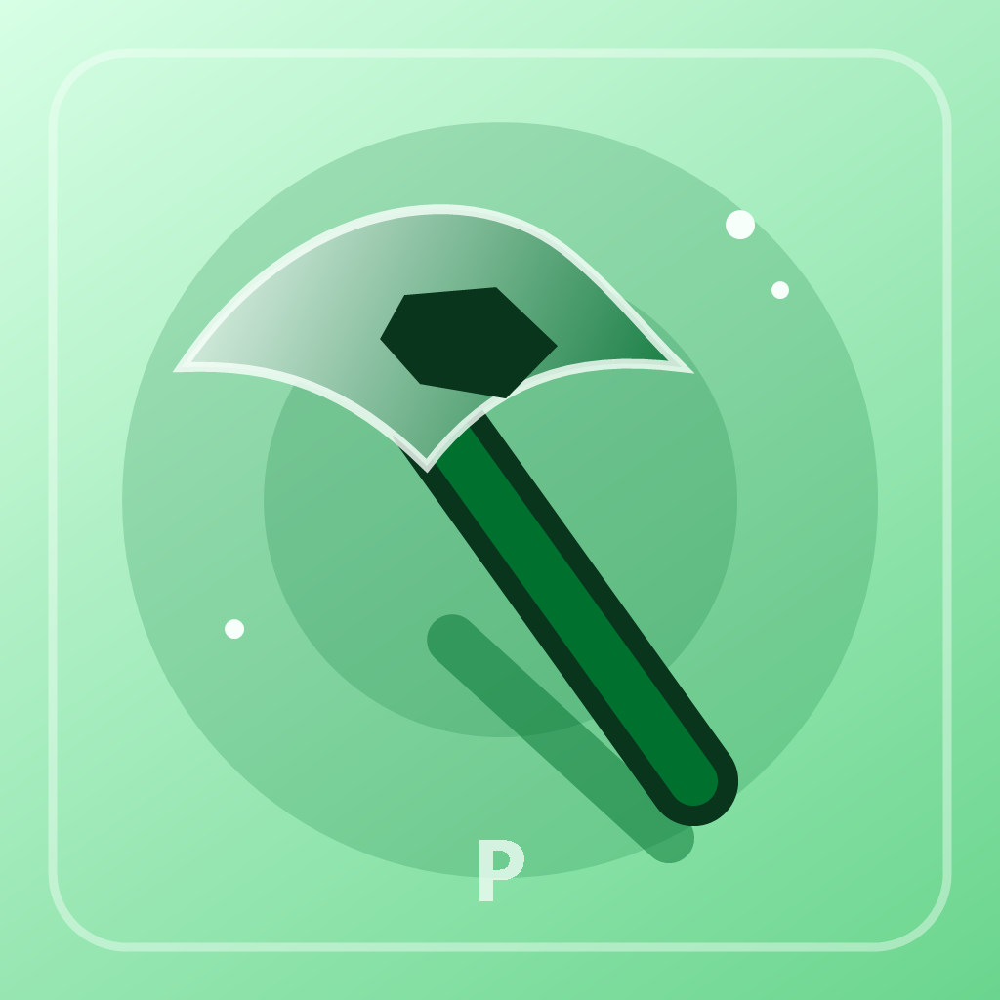

<div align="center">
  

  # P1ck4x3

  **P1ck4x3 is an iPhone personalization utility for compatible iOS versions.**

  It lets experienced sideloading users customize wallpapers, passcode keys,
  supported Wallet cards, Home Screen elements, Dynamic Island and Dock lighting
  from one app. Private system operations require careful compatibility checks.

  [](https://github.com/Nnnnnnn274/P1ck4x3/releases)
  [](https://github.com/Nnnnnnn274/P1ck4x3/releases)
  [](https://github.com/Nnnnnnn274/P1ck4x3/stargazers)
  [](LICENSE)

  <br>

  <a href="https://github.com/Nnnnnnn274/P1ck4x3/releases">
    
  </a>

  <br><br>

  [Release notes](https://github.com/Nnnnnnn274/P1ck4x3/releases)
  · [Report a bug](https://github.com/Nnnnnnn274/P1ck4x3/issues/new?template=bug_report.md)
  · [Request a feature](https://github.com/Nnnnnnn274/P1ck4x3/issues/new?template=feature_request.md)

  <sub>The release IPA is unsigned. Sign it with your usual personal-device installation method.</sub>
</div>

---

## At a glance

| | |
|---|---|
| **Current codebase** | P1ck4x3 1.0.6 · Eagle 1.0.5 base · build 93 |
| **Primarily verified on** | iPhone 16 Pro (`iPhone17,1`) · iOS 18.6.2 (`22G100`) |
| **Architecture** | `arm64e` |
| **Verified Aura surfaces** | Dynamic Island, Dock and current-page icon glow/outline · isolated apply and verification |
| **Project status** | Stable release · test one change at a time |

> [!WARNING]
> P1ck4x3 uses kernel-level and private SpringBoard capabilities. An incompatible
> operation can respring or reboot the device. Back up important data, test one
> change at a time and do not treat this as a production-safe utility.

## What P1ck4x3 includes

| Experience | What it does |
|---|---|
| 🎨 **Styles** | Coordinates wallpaper, passcode and Wallet-card experiences. |
| 🌌 **Wallpapers** | Browses community packs, imports compatible packages and converts short videos for Pocket Poster. |
| 💳 **Cards** | Previews, applies, backs up and restores supported Wallet card artwork. |
| 🔢 **Passcode** | Browses, imports, previews, applies and restores compatible key themes. |
| 🧩 **Icon Studio · Coming soon** | Temporarily unavailable while theme importing and custom shapes are validated. |
| 📱 **Dock** | Provides layouts supporting up to six apps where SpringBoard accepts them. |
| ✨ **Aura Studio** | Applies independently colored Dynamic Island and Dock lighting, manages the system Island and Dock background, and keeps verified surface state isolated. |
| 🖼️ **Island Gallery** | Offers curated Live and Static artwork, Saves, adjustable shadow and precise placement. |
| 🌈 **Dock Gallery** | Places static and Live artwork behind Dock apps, with Saves, adjustable glow and precise placement. |
| 🔤 **App Name Color · Advanced** | Applies a page-owned solid color to app names on the current Home Screen page. |
| 🧪 **Laboratory** | Reveals advanced offset, Kernelcache and RemoteCall controls when selected in Compatibility. |
| 🎛️ **Control Center Accents** | Adds temporary Mint, Ocean or Rose borders to recognized Control Center modules on iOS 18. Requires Laboratory; a respring clears the effect. |
| 🛡️ **P1ck4x3 System** | Adds Guardian checks, Scenes and shareable personalization recipes. |

### New from Eagle 1.0.5

- Refreshed Island and Dock Galleries with clearer Live/Static/Saves navigation, focused preview animations, safer media lifetimes and precise quarter-point position controls.
- Added position controls to Aura Studio without changing its existing apply engine.
- Added native translucent Access/Customize navigation and result notifications that do not shift the app content.
- Prepare keeps its animated rainbow progress, uses a readable green action and transitions smoothly to Ready.
- Separated general Settings from Laboratory Tools and updated the first-launch Updates window.
- Corrected white-on-white action text in Cards and related controls; removed three unsuitable Dock-derived styles from Island Gallery while leaving them in Dock.
- Retained ownership checks and recovery paths for theme, Aura and Hide Dock operations. Apply and Prepare still require compatible devices and should be tested one change at a time.

### Aura Studio safety model

- Dynamic Island and Dock are isolated operations: one surface is never marked
  active merely because the other succeeded.
- Rainbow is available for Dynamic Island. Dock Rainbow remains disabled because
  it has not been proven reliable on a physical device.
- Home Icon Neon is initially allowlisted for iPhone 16 Pro (`iPhone17,1`) on
  iOS 18.6.2 (`22G100`) and applies a one-time snapshot page by page.
- A failed verification keeps the safety lock closed and does not trigger an
  automatic respring.
- Aura overlays may disappear after a SpringBoard respring or device reboot and
  must then be applied again.

## Install P1ck4x3

1. Use the large **Download P1ck4x3.ipa** button at the top of this page.
2. Sign the unsigned IPA with your preferred personal-device sideloading method.
3. Install it and open P1ck4x3 manually from the Home Screen.
4. If you installed through Xcode, press **Stop** before preparing P1ck4x3 access.
5. Apply one feature at a time and keep the exact result message if something fails.

Looking for an older build? Browse [all P1ck4x3 releases](https://github.com/Nnnnnnn274/P1ck4x3/releases).

## Compatibility and current limits

- **Prepare support:** iOS 16.x has limited testing (16.7.2 is the verified limited route);
  iOS 17.0–18.7.1 and 26.0–26.0.1 are accepted.
- Unverified iOS 16 builds, releases outside the supported ranges above and
  current MIE devices are blocked.
- iPhone 16 (`iPhone17,3`) running iOS 18.5 follows the supported Prepare route.
- Aura Studio live changes remain limited to verified iOS 17/18 SpringBoard routes.
- If Island Aura reports **Safe Compact Halo**, it will not expand with music,
  screen recording or timers. Only **Adaptive Aura** follows those layouts.
- Screen, Battery Halo and Lock experiments are hidden while their live
  SpringBoard hosts remain unverified.
- Dock and Dynamic Island Aura include dedicated geometry for iPhone 14 Pro,
  iPhone 14 Pro Max and the primary iPhone 16 Pro reference profile. Other
  supported models may still require model-specific validation.
- Icon importing, nonstandard masks and community packages remain dependent on
  device, iOS version and package structure.
- Kernel or SpringBoard operations are intentionally blocked while the Xcode
  debugger is attached.

Device strings such as `iPhone15,2` are Apple's technical model identifiers
(`iPhone15,2` is an iPhone 14 Pro), not the marketing generation number.

## Build from source

Requirements:

- macOS with Xcode
- the `codesign` tool included with macOS/Xcode

Compile without installing on a device:

```sh
xcodebuild -project lara.xcodeproj \
  -scheme lara \
  -configuration Debug \
  -destination 'generic/platform=iOS' \
  CODE_SIGNING_ALLOWED=NO build
```

Package the release IPA:

```sh
./scripts/build_ipa.sh
```

The result is written to `build/P1CK4X3.ipa`.

Pushing a version tag such as `v1.0.6` runs the same build and publishes its
unsigned IPA as a GitHub Release after the build succeeds. The workflow can
also publish an existing `v*` tag from **Run workflow** by entering it in the
`release_tag` field.

## Report a problem

Open the [guided bug report](https://github.com/Nnnnnnn274/P1ck4x3/issues/new?template=bug_report.md)
and include:

- exact iPhone or iPad model;
- iOS version and build number;
- P1ck4x3 version or commit;
- feature and selected mode;
- exact result message;
- the shareable Prepare or Aura diagnostic report when P1ck4x3 offers one;
- a full-width screenshot when the problem is visual;
- the relevant end of `Documents/lara.log`, with personal paths removed.

Do not publish tokens, certificates, provisioning profiles or unrelated personal files.

## Project lineage, license and acknowledgements

P1ck4x3 is based on [Eagle](https://github.com/leonardob8777-bit/Eagle), which is
a modified version of [Lara](https://github.com/rooootdev/lara).

P1ck4x3 is licensed as a whole under [GNU AGPL-3.0](LICENSE), preserving Eagle's and Lara's
license and notices. Source distributions and modified builds must continue to
comply with that license.

Core acknowledgements include the Lara contributors, rooootdev, opa334, ChOma,
XPF, AlfieCG/libgrabkernel2, DarkSword contributors, AppInstaller iOS and the
upstream projects whose notices remain in [`lara/licenses`](lara/licenses).
Portions of the OTA implementation are adapted from
[Cyanide](https://github.com/0xjohnnydev/cyanide) by
[0xjohnny](https://github.com/0xjohnnydev) (formerly zeroxjf), first published
in May 2026 under AGPL-3.0 and inherited through Lara. See the
[Cyanide OTA notice](lara/licenses/NOTICE_Cyanide_OTA.md) for provenance links.
The on-device PosterBoard descriptor import bridge is adapted from
[Pocket Poster](https://github.com/leminlimez/Pocket-Poster) by leminlimez,
published under GPL-3.0. See the
[Pocket Poster notice](lara/licenses/NOTICE_Pocket_Poster.md) for the exact
upstream files and license links.
See Lara's [contributor history](https://github.com/rooootdev/lara/graphs/contributors)
for the complete upstream record.

---

<div align="center">
  <strong>P1ck4x3</strong> · precise customization, explicit verification
  <br>
  <sub>Built with Swift, SwiftUI and DarkSword.</sub>
</div>
